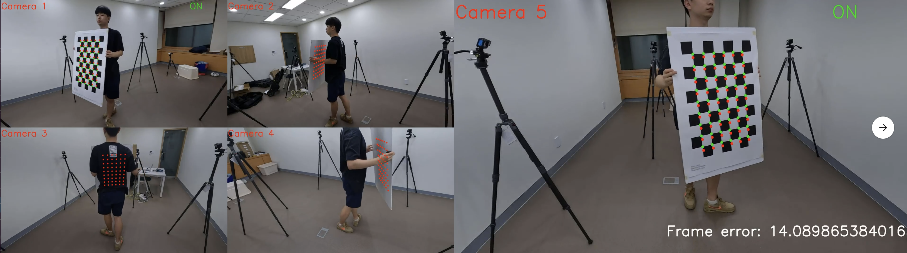
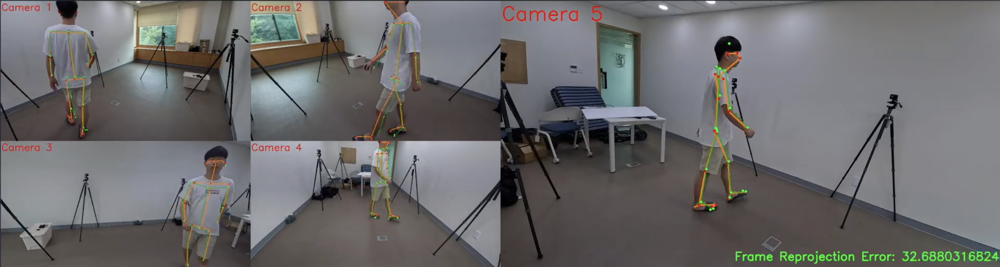
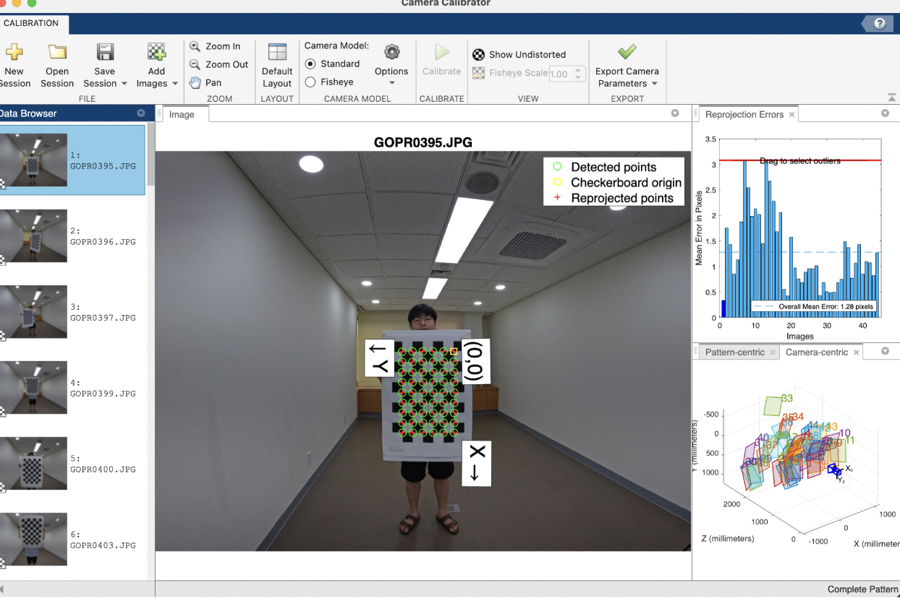
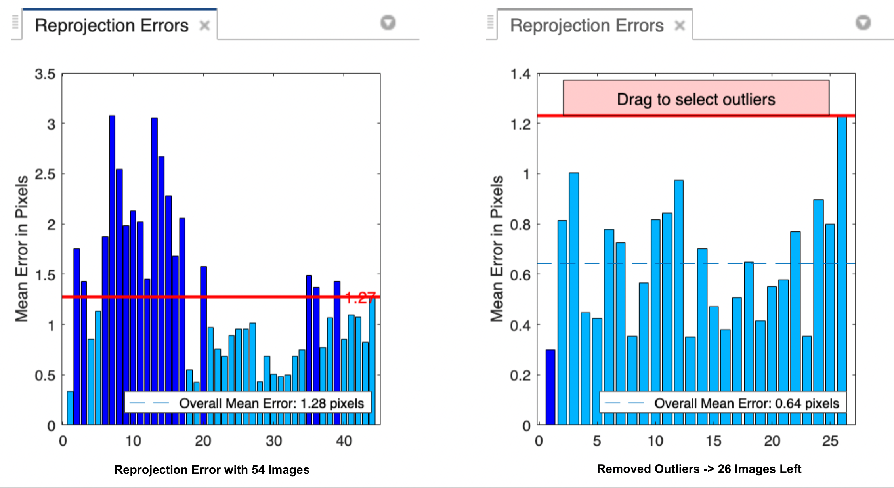
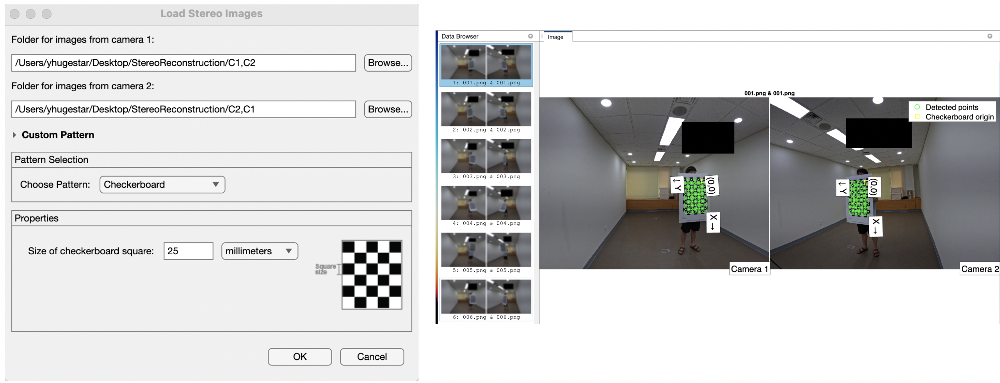
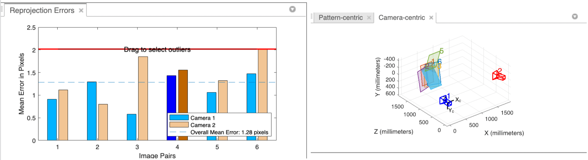
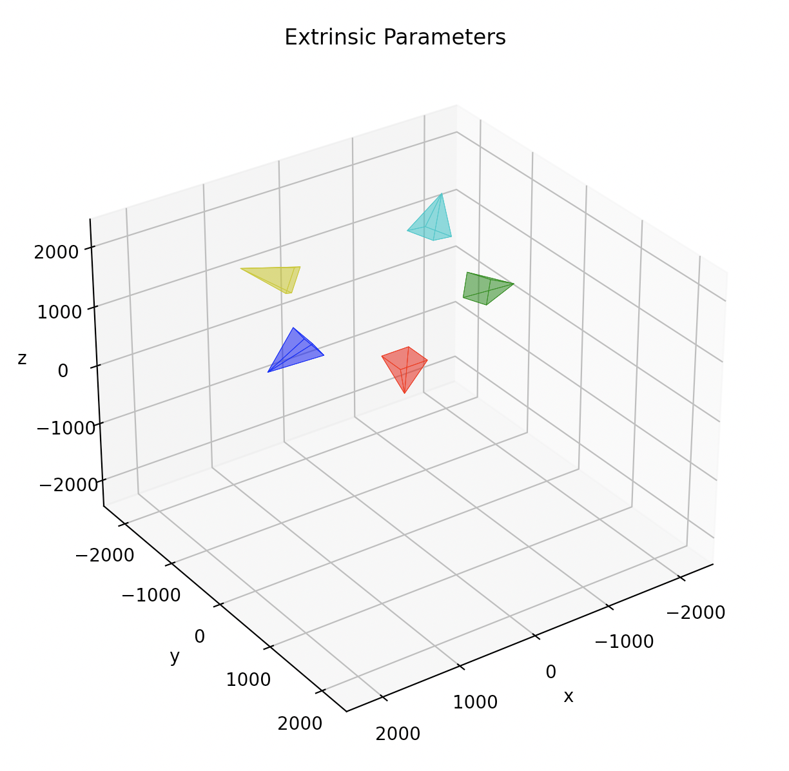

# Stereo Reconstruction - Reconstructing 3D Human Keypoints from 2D Images
This is my implementation of Stereo Camera Reconstruction using DLT (Direct Linear Transform), Triangulation with Linear/Non-Linear Optimization through Python. <br/> 

<br/>
> - Red points indicate the 2D reprojection of the reconstructed 3D points. <br/>
> - Green points indicate the 2D points found by MATLAB's Camera Calibrator.<br/> 
> - The "ON" sign in green indicates that the checkerboard points have been detected with MATLAB's calibrator. There must be at least 2 cameras with "ON" sign in order to reconstruct 3D points.<br/> 
> - The "Frame Error" indicates the average reprojection error (Euclidean distance) of points of the reconstructed 3D points. <br/>

<br/><br/> 
> - Green joints indicate the 2D reprojection of the reconstructed 3D joints. <br/>
> - Orange joints indicate the 2D joints found by openpose.<br/> 
> - The "Frame Reprojection Error" indicates the average reprojection error (Euclidean distance) of points of the reconstructed 3D joints. <br/>

## Environment Setup
> Note: This code was developed on Ubuntu 20.04/22.04 with Python 3.7. Later versions should work, but have not been tested.
Create and activate a virtual environment to work in, e.g. using Conda:

```
conda create -n venv_stereo python=3.7
conda activate venv_stereo
```
Install the remaining requirements with pip:
```
pip install -r requirements.txt
```

You must also have _ffmpeg_ installed on your system to save visualizations. <br/><br/>
I have used 5 _GOPRO10_ cameras for this task. If you are using more or less cameras, you need to modify the DLT, optimization code. 

### MATLAB Stereo Camera Calibrator Application (Optional)
> - This repo uses MATLAB for camera calibration and checkerboard point detection. You may use other methods for calibration (eg. OpenCV, COLMAP, Visual SFM).
> - In MATLAB, install the ```Computer Vision Toolbox``` and you will find the ```Camera Calibrator```, and the ```Stereo Camera Calibrator```.
> - The ```Stereo Camera Calibrator``` is capable of finding both the extrinsics and intrinsics of the camera. However, I found that the Camera Calibrator gives more stable results for finding the camera intrinsic parameters. I highly recommend you to use both tools for calibration. 

Finding the Intrinsics

> - It is recommended to use more than 20 checkerboard images using the ```Camera Calibrator``` app. 
> - The app lets you remove the outliers, if a reprojection of a image is too big (larger than 5), remove the outliers and re-run the calibration process. 

<p align="center">
   <br/>
Detected checkerboard points, reprojected points
</p>

<br/><br/>

<p align="center">
   <br/>
Removing outliers, refined results
</p>

Finding the Extrinsics
> - It is recommended to use more than 20 matching pair of images. 
> - Taking a video, extracting frames, and manually selecting pairs of images may be helpful in increasing the accuracy. 
> - Make sure that the cameras are <b>synchronized</b>. If the camera does not offer synchronization, one solution may be to place a digital clock in the back of the scene and check the time while manaully selecting stereo pairs of images. 

<p align="center">
   <br/>
Pair of images at Camera 1 and Camera 2
</p>

<p align="center">
   <br/>
MATLAB's extrinsic parameter visualizer
</p>
<br/>
<br/>

> - I've manually coded a way to visualize camera parameters. To use the code, modify the extrinsic camera parameters in the file ```visualizer/extrinsic_visualizer.py```
<p align="center">
   <br/>
Visualization of camera extrinsics using my implemented visualizer
</p>

### OpenPose
> - [OpenPose](https://github.com/CMU-Perceptual-Computing-Lab/openpose) is used to detect 2D joints from arbitrary RGB videos.<br/>
> - Please install openpose and run it on your undistorted image frames to locate the 2D keypoints. <br/> 
> - Before running OpenPose, make sure that the input images are <b>undistorted</b>. There is a MATLAB code in the repo ```undistort_image.m``` that undistort images. Just modify the camera parameters and the structure of the folder directory and you will be set to go. 
> -  For the format of the output pose, this code is based on the "BODY_25" format, please add the ```--model_pose BODY_25 ``` flags in order to match the format of the output .json files used in this repo. <br/>
> - The output .json file should look something like: <br/>
```{"version":1.3,"people":[{"person_id":[-1],"pose_keypoints_2d":[2055.39,265.531,0.874508,2267.43,542.444,0.678595,2190.91,559.855,0.566347,2037.84,865.877,0.602067,1766.9,772.016,0.519303,2326.48,542.172,0.704926,2055.42,901.382,0.770255 ... ]}```

<p align="center">
  
</p>


